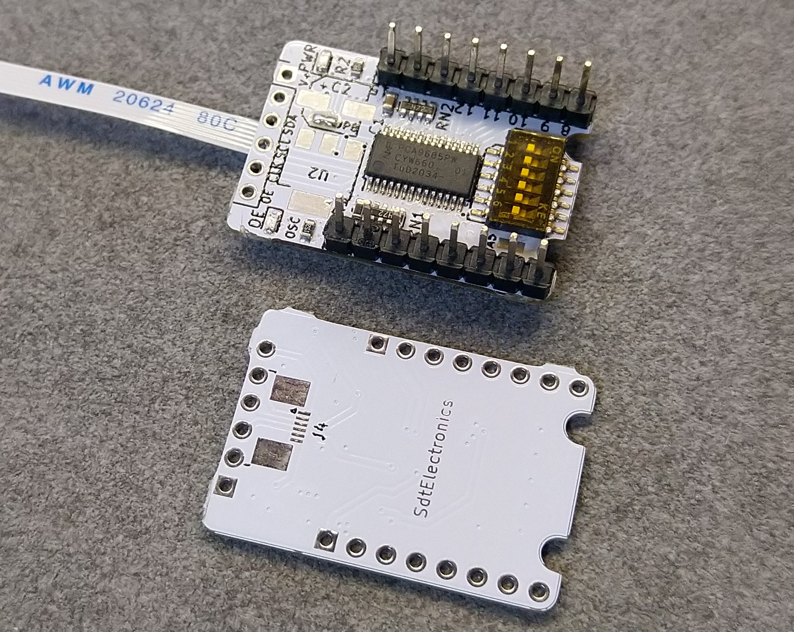

# PCA9685_Breakout
Breakout board for PCA9685 I²C to 16-channel PWM controller.

## Highlights:
* Compact in size. Breadboard-friendly layout.
* Conveniently configurable address set by dip switch.
* Integrated pull resistors provide a ready-to-use configuration.

## Status:
Partially verified.
