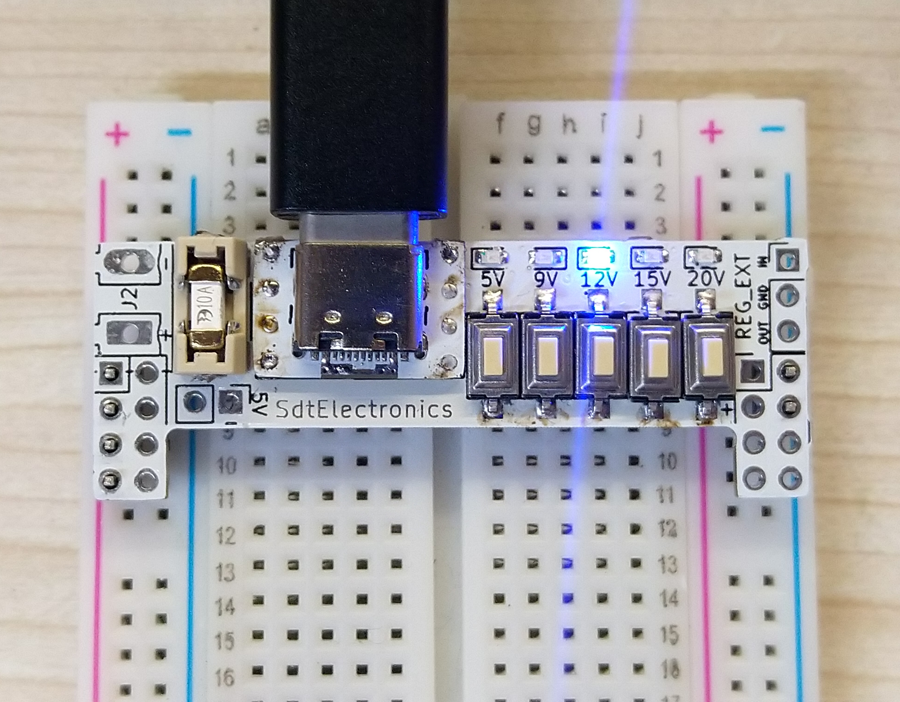

# BBSink
USB-PD sink with headers compatible with breadboard. Features a fixed 3.3V supply and one-click voltage selection without incorporating MCUs. 

## Highlights
* Dual channel supplies with one fixed 3.3V output and one 5V / 9V / 12V / 15V / 20V configurable output
* User-friendly operation: one-click voltage selection and LED indicators
* Incorporates no MCU and is therefore cheap and programming-free

## Instructions on Building
This design consists two PCBs: a base board and a CH224K Core board which owns [its separate directory](https://github.com/SdtElectronics/Biscuits/tree/master/CH224Core). The layout file [ch224baseProdt](https://github.com/SdtElectronics/Biscuits/blob/master/bbSink/ch224baseProdt.kicad_pcb) in this folder combines two PCBs together so they can be (ordered and) manufactured at once.

The layout of this board took special consideration on soldering: All footprints with small pitches are arranged on the bottom side so they can be soldered easily with paste and heat guns or PTC heating tables. Components on the top side should be dealt afterwards.

## Outputs
The primary outputs are two 2x4 pin headers compatible with breadboards. Headers on left supply voltage sunk from the USB-C port while headers on right supply a fixed 3.3V output. In both sides, positive terminal is left column and GND is on right.

Besides the pin headers, the sunk voltage is also supplied with a pad for connectors of 5.08mm pitches. On the right side, if the pad for external regulator is unused, it can also act as a 3.3V supply.

Below the pad for fuse, there is another pin header. This is connected to the internal 5V regulator of `MPM3620`. Its load characteristic is not clearly specified by the datasheet so better not to rely on it.

## 3V3 Step Down Circuitry
There are 3 options to generate a 3.3V supply for on-board circuits and output:
* A compact DC-DC circuit employing `MPM3620` synchronous converter with integrated inductor. This requires `R4` - `R7` being soldered.
* Any LDO in SOT-223 package with pin assignment compatible with `LM1117`. Do beware of the voltage rating of the LDO you choose: `LM1117` only tolerates input up to 15V thus it cannot be operated safely when sinking 20V. An alternative with higher rating is `NCP1117`.
* An external regulator can be connected to the board with a 78XX compatible pad at `REG_EXT`. 

You can opt into any of the three above but don't use them in parallel. That would be most unlikely to increase the output current.

## Notes
* The LEDs indicate the selected voltage required by the sink IC, rather than the actual output voltage.
* `CH224K` claims it also supports BC1.2 protocol, which I have barely heard of it. It seems to be a common base of a family of protocols including QC2.0. I have tested this board with a QC2.0 charger for my Nokia 7 Plus, and it can sink 5V, 9V and 12V as well.
* If you don't want a fuse just short it with `JP1`. Or you can solder something interesting on it e.g. a SMD switch.

## Known Issues
The output voltage on power up is undetermined until a button is pressed, although it should be 9V in most of the time. I have designed a RC pulse generator to set the default voltage level to 5V but it failed miserably: the capacitor `C1` is either too small to trigger the logic components, or too large that the state can't be hold after being triggered. Therefore, the pad for `C1` should be left unconnected for now. Someday I will fix this or maybe never, cause I'm too lazy to devote to such minor functionality...